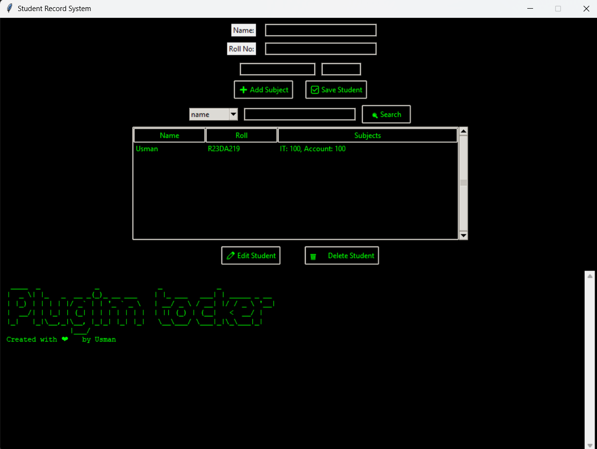

# 🎓 Student Record System (Retro GUI Version)

A Python-based **Student Record Management System** using **Tkinter** and **SQLite**, now enhanced with **AI-powered PDF scanning via Ollama** and a smart fallback to **Tesseract OCR**. It features a sleek, nostalgic **green-on-black retro terminal aesthetic**, combining functionality with style.

---

## ✨ Features

- ➕ Add students with **name**, **roll number**, and **subject-wise marks**
- 📄 **Scan mark sheet PDFs** and auto-fill details (supports both digital and scanned PDFs)
- 🧠 NEW: **Ollama AI integration** for smarter, flexible mark sheet parsing (supports various formats)
- 🔍 Search students by **name** or **roll number**
- ✏️ Edit existing student records
- 🗑️ Delete students with one click
- ➕ Dynamically add/remove any number of subjects
- 📁 Data stored persistently in **SQLite**
- 🖥️ GUI built with **Tkinter**
- 🎨 Retro-themed **green-on-black** interface (Terminal vibes!)
- 🪄 **No need to install Python** – Windows `.exe` available under [`releases/`](https://github.com/usa1991/student-record-system/releases)
- ✅ Automatically falls back to **Tesseract OCR** if AI is unavailable

---

## 🧠 AI-Powered OCR (Ollama)

If installed, the app can use your **local Ollama model** (like `mistral`, `llama3`, etc.) to extract marks, name, and roll number from PDFs – even if formatting varies.

> 📦 Requires: [Ollama](https://ollama.com) installed and running locally.

---

## 📸 Screenshot



---

## 🧑‍💻 How to Use (from Source)

### 1. Clone the Repository:

```bash
git clone https://github.com/usa1991/student-record-system.git
cd student-record-system
